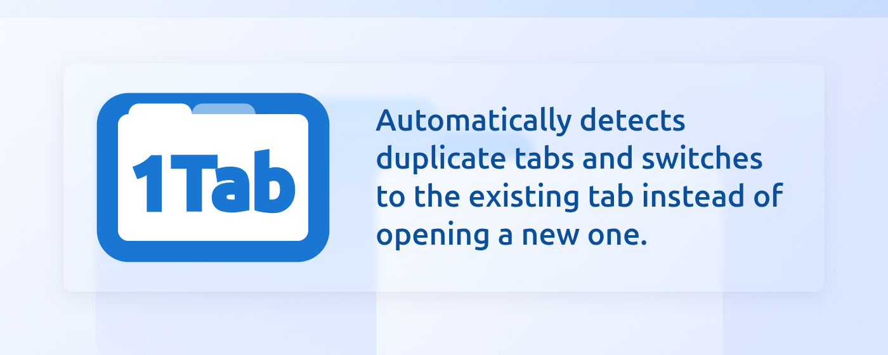
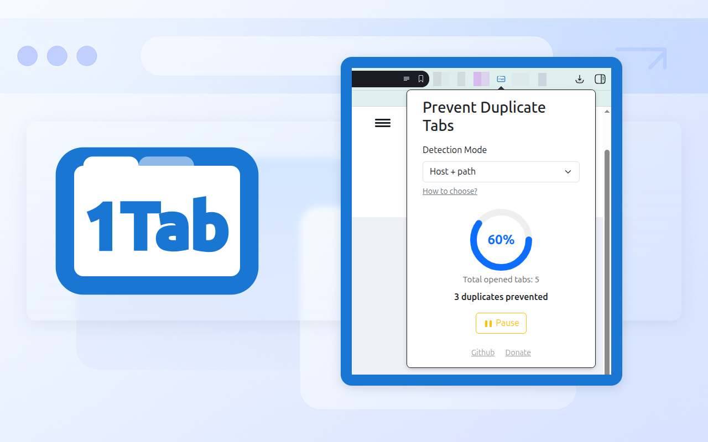
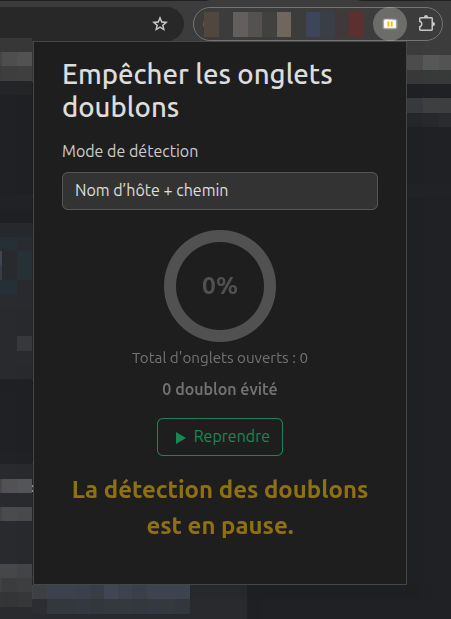
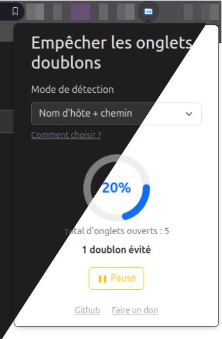

  

# 1tab-chrome-extension

Automatically detects duplicate tabs and switches to the existing tab instead of opening a new one.

<!-- TOC -->

  * [Installation](#installation)
  * [How it works & Configuration](#how-it-works--configuration)
    * [Configuration](#configuration)
    * [Statistics](#statistics)
    * [Pause](#pause)
      * [Extension Icon States](#extension-icon-states)
    * [Theme](#theme)
  * [Planned Features & Improvements](#planned-features--improvements)
  * [Contributing](#contributing)
  * [Tests](#tests)
  * [License](#license)
  * [Donation](#donation)
  * [AI usage](#ai-usage)
<!-- TOC -->

## Installation

This extension is not yet available on the Chrome Web Store. To install it manually:

1. **Download the `.crx` file** from the [Releases](https://github.com/wollanup/1tab-chrome-extension/releases) section of this repository.
2. Open Chrome and go to `chrome://extensions/`.
3. Enable **Developer mode** (top right corner).
4. Drag and drop the `.crx` file onto the extensions page.
5. Confirm the installation.

> **Note:** If Chrome shows a warning, click "Continue" or "Add extension".

## How it works & Configuration

This extension automatically prevents duplicate tabs by checking for existing tabs when you open a new one. If a duplicate is found, it switches to the existing tab instead of opening a new one.

If a duplicate tab is opened in the background (for example, with a middle-click), it will be immediately closed by the extension.

### Configuration

You can choose how duplicates are detected using the popup:
- **Path (default):** Tabs are considered duplicates if they share the same host and path (ignoring subdomains and www).
    - Example: `https://www.google.com/search?q=test` and `https://mail.google.com/search?q=other` are duplicates in path mode (both → google.com/search).
    - Example: `https://www.example.com/page#section` and `https://www.example.com/page` are duplicates in path mode (fragment ignored).
- **Exact:** Tabs are considered duplicates only if the full URL (origin/path?query) matches, ignoring the fragment (#hash) and protocol.
  - Example: `https://www.google.com/search?q=test` and `https://www.google.com/search?q=other` are NOT duplicates in exact mode.
  - Example: `https://www.example.com/page#section` and `https://www.example.com/page` are duplicates in exact mode (fragment ignored).
- **Domain:** Tabs are considered duplicates if they share the same root domain (ignoring subdomains and www).
  - Example: `https://www.google.com/search?q=test` and `https://mail.google.com/` are duplicates in domain mode (both → google.com).
  - Example: `https://www.example.com` and `https://blog.example.com` are duplicates in domain mode (both → example.com).

> **Note:**
> - The term "domain" refers to the root domain (e.g. `example.com`), not the full host (which may include subdomains).
> - The term "path" refers to the part after the domain, e.g. `/search` in `google.com/search`.
> - "Exact" mode uses the host, path, and query string, but ignores the fragment (#hash).
> **Default mode:**
> The extension uses **Path** mode by default. Tabs are considered duplicates if they share the same root domain and path (ignoring subdomains and www). You can change this in the popup at any time.

### Statistics

A round gauge in the popup shows the number of duplicate tabs prevented since launch, the percentage, and the total number of opened tabs.

### Pause

|  | You can temporarily pause duplicate tab detection using the Pause button in the popup. When paused, the extension will not prevent duplicate tabs until you click Resume or restart the browser. |
|----------------------------------------------|-----------------------------------------------------------------------------------------------------------------------------------------------------------------------------------------------------|

#### Extension Icon States

The extension icon changes according to its state:

| Active                                                                    | Paused                                                                           |
|---------------------------------------------------------------------------|----------------------------------------------------------------------------------|
|  |  |

When paused, the icon becomes monochrome with an orange pause symbol.
### Theme

|  | Automatic dark/light theme detection is available, based on browser and OS preferences. |
|-----------------------------------------|-----------------------------------------------------------------------------------------|

## Planned Features & Improvements

Here are some features planned for future releases:
- Publish the extension on the Chrome Web Store
- Allow users to whitelist or blacklist specific URLs or domains
- Provide a better debug/log interface for troubleshooting
- Support for other browsers (Firefox ?)

If you have suggestions, feel free to open an issue!

## Contributing

Contributions are welcome! Feel free to open an issue or submit a pull request.

## Tests

Unit tests are not available yet for this extension. Testing support will be added in future releases.

## License

This project is licensed under the MIT License.

## Donation

If you like this free extension, please consider buying me a beer!

## AI usage

This extension was originally a personal project. Some parts of the code were written with the help of GitHub Copilot and ChatGPT, which assisted in code generation, refactoring, and documentation.
