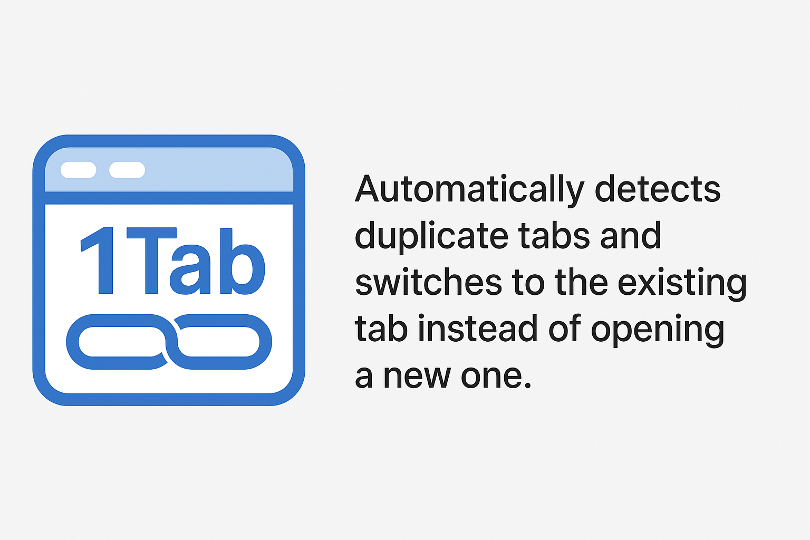

# 1tab-chrome-extension

Automatically detects duplicate tabs and switches to the existing tab instead of opening a new one.

## Installation

This extension is not yet available on the Chrome Web Store. To install it manually:

1. **Download the `.crx` file** from the [Releases](https://github.com/wollanup/1tab-chrome-extension/releases) section of this repository.
2. Open Chrome and go to `chrome://extensions/`.
3. Enable **Developer mode** (top right corner).
4. Drag and drop the `.crx` file onto the extensions page.
5. Confirm the installation.

> **Note:** If Chrome shows a warning, click "Continue" or "Add extension".

## How it works & Configuration

This extension automatically prevents duplicate tabs by checking for existing tabs when you open a new one. If a duplicate is found, it switches to the existing tab instead of opening a new one.

### Configuration
You can choose how duplicates are detected using the popup:
- **Exact:** Only tabs with the exact same URL are considered duplicates.
- **Domain:** Tabs with the same domain are considered duplicates.
- **Path:** Tabs with the same domain and path are considered duplicates.

Your selection is saved and used for future tab checks. Debug mode is available for troubleshooting, but not exposed in the popup yet.

## Contributing

Contributions are welcome! Feel free to open an issue or submit a pull request.

## Tests

Unit tests are not available yet for this extension. Testing support will be added in future releases.

## License

This project is licensed under the MIT License.
