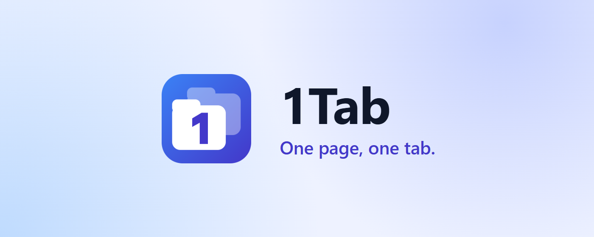
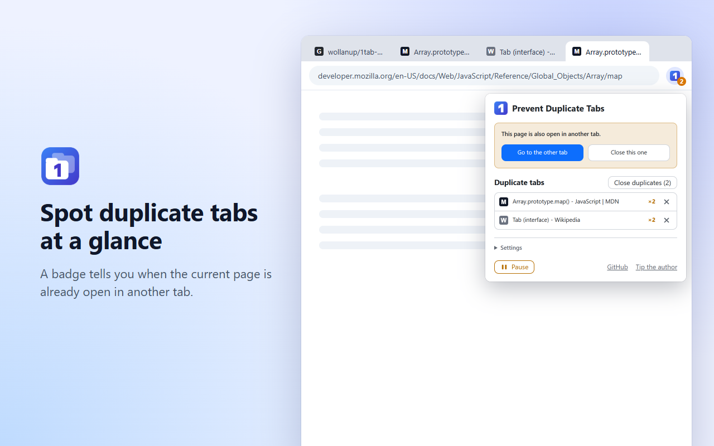
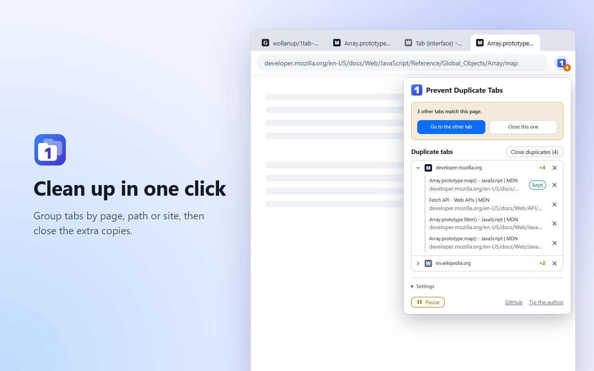
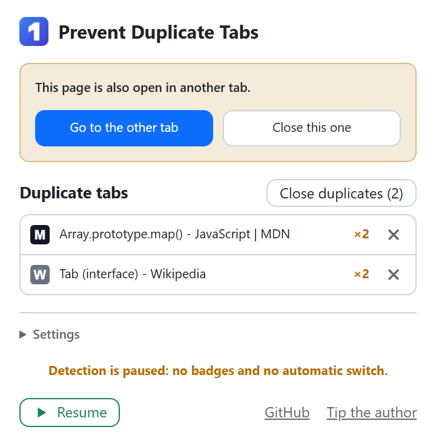
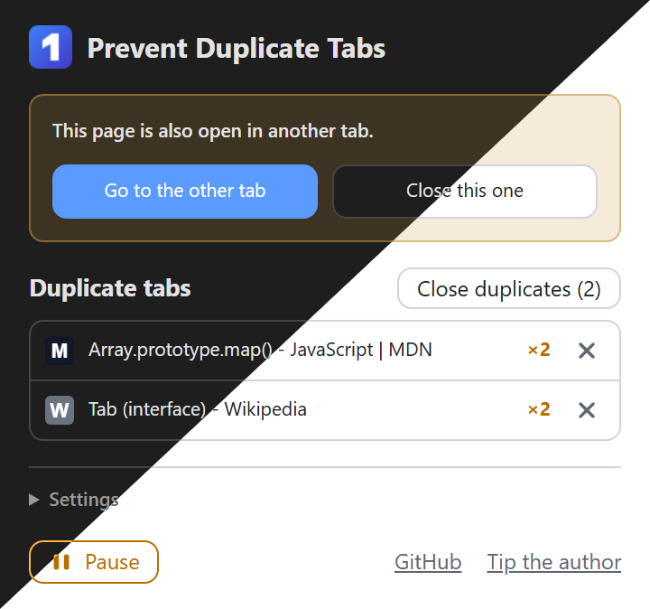

[](https://ko-fi.com/O4O2165S0Q)

# 1Tab — Chrome Extension

1Tab is a Chrome extension that spots duplicate tabs: a badge on its icon tells you when the current page is already open in another tab, and the popup takes you to it or closes the copies in one click.

<!-- TOC -->
  * [Installation](#installation)
  * [How it works & Configuration](#how-it-works--configuration)
    * [Detection modes](#detection-modes)
    * [Automatic switch](#automatic-switch)
    * [Pause](#pause)
    * [Theme](#theme)
  * [Planned Features & Improvements](#planned-features--improvements)
  * [Contributing](#contributing)
  * [License](#license)
  * [Tip](#tip)
  * [AI usage](#ai-usage)
<!-- TOC -->

## Installation

Works with Chrome 123+ and other Chromium browsers (Edge, Brave, Opera, Vivaldi…).

1. Download the `.zip` file from the [Releases](https://github.com/wollanup/1tab-chrome-extension/releases) section and unzip it.
2. Open `chrome://extensions/` and enable **Developer mode** (top right corner).
3. Click **Load unpacked** and select the unzipped folder.

## How it works & Configuration

When the current page is also open in other tabs, the extension icon shows the number of copies. Open the popup to go to the other tab, close this one, or close all duplicates at once (the current tab and pinned tabs are kept).



### Detection modes

Choose in the popup settings how tabs are compared. `http`/`https` and `www.` are always ignored.

- **Exact page (default):** same address, ignoring the anchor (`#section`) and tracking parameters (`utm_*`, `fbclid`…).
  - `google.com/search?q=test` and `google.com/search?q=other` are different.
- **Host + path:** same site and path, whatever the parameters.
  - `google.com/search?q=test` and `google.com/search?q=other` are duplicates.
- **Host only:** one tab per site.
  - `example.com` and `example.com/about` are duplicates, `blog.example.com` is a different site.

In host modes, unfold a group in the popup to see its tabs.



### Automatic switch

Off by default. When enabled in the popup settings, opening a page that is already open in a new foreground tab takes you to the existing tab instead. Links opened in the background (Ctrl+click, middle click) are never closed, and navigating inside a tab never closes it.

### Pause

|  | You can pause duplicate detection with the Pause button in the popup.<br>When paused, there are no badges and no automatic switch until you click Resume or restart the browser. |
|---|---|

The extension icon changes according to its state:

| Active | Paused |
|---|---|
|  |  |

### Theme

|  | The popup follows the light or dark theme of your browser and OS. |
|---|---|

## Planned Features & Improvements

- Publish the extension on the Chrome Web Store
- Allow users to exclude specific URLs or domains
- Support for other browsers (Firefox?)

If you have suggestions, feel free to open an issue!

## Contributing

Contributions are welcome! Feel free to open an issue or submit a pull request.

The extension has no dependencies and no build step: load the `src/` folder with **Load unpacked**. With Node.js 22+:

```bash
npm test             # unit tests
npm run test:e2e     # end-to-end tests in headless Chrome
npm run check        # manifest and translations
npm run media        # regenerate the screenshots
```

## License

This project is licensed under the MIT License. 1Tab collects no data, see [PRIVACY.md](PRIVACY.md).

## Tip

If you like this free extension, please consider buying me a beer!

[](https://ko-fi.com/O4O2165S0Q)

## AI usage

This extension was originally a personal project. Some parts of the code were written with the help of GitHub Copilot, ChatGPT and Claude Code, which assisted in code generation, refactoring and documentation.
