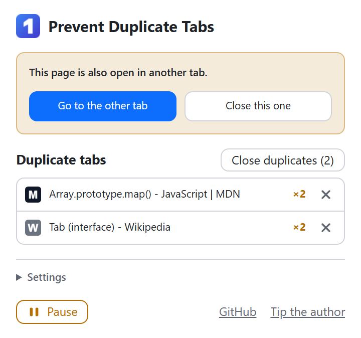
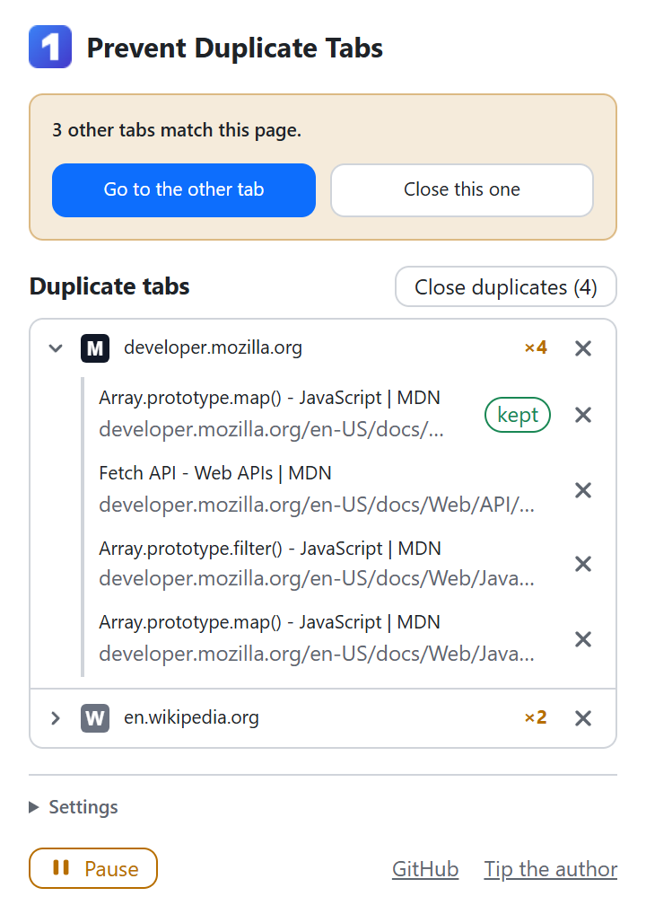
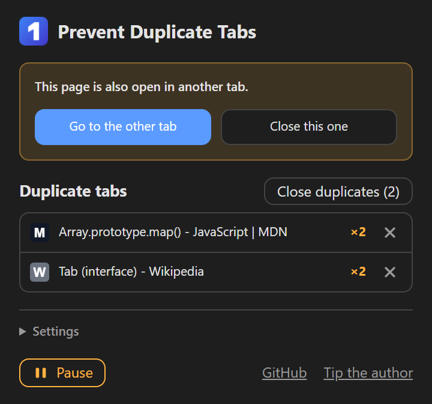

# 1Tab — Duplicate tabs, spotted and cleaned up

[](https://github.com/wollanup/1tab-chrome-extension/actions/workflows/ci.yml)
[](https://ko-fi.com/O4O2165S0Q)

1Tab is a Chrome extension that spots duplicate tabs. A badge on its icon tells you when the current page is already open in another tab, and the popup takes you to it or closes the extra copies in one click. It never closes a tab behind your back, unless you turn on the automatic switch.

<table>
  <tr>
    <td></td>
    <td></td>
  </tr>
</table>

<!-- TOC -->
* [Installation](#installation)
* [How it works](#how-it-works)
  * [Detection modes](#detection-modes)
  * [Automatic switch](#automatic-switch)
  * [Pause](#pause)
* [Privacy](#privacy)
* [Development](#development)
* [Contributing](#contributing)
* [License](#license)
* [AI usage](#ai-usage)
<!-- TOC -->

## Installation

1Tab works with Chrome 123+ and other Chromium browsers supporting Manifest V3 (Edge, Brave, Opera, Vivaldi…).

1. Download `1tab-vX.Y.Z.zip` from the [latest release](https://github.com/wollanup/1tab-chrome-extension/releases/latest) and unzip it.
2. Open `chrome://extensions/` and enable **Developer mode** (top right).
3. Click **Load unpacked** and select the unzipped folder.

## How it works

**Badge.** When the current page is also open in other tabs, the extension icon shows the number of copies (e.g. `2`).

**Popup.**
- If the current page is open elsewhere: **Go to the other tab** or **Close this one**.
- The list of all duplicate tabs: click one to go to it, `✕` closes its extra copies, **Close duplicates (N)** cleans everything up. The current tab is kept if it is one of the copies, otherwise the most recently used one. Pinned tabs are never closed.
- In **Host + path** and **Host only** modes, a row groups different pages: the arrow unfolds it to show each tab (title and URL), which you can open or close one by one. The tab that would be kept is marked.

Browser pages (new tab, settings, extensions…), `about:blank`, local files and popup windows are ignored. Incognito tabs are only compared with other incognito tabs.

### Detection modes

In every mode, the scheme (`http`/`https`), the case of the host and a leading `www.` are ignored, while the port matters (`localhost:3000` ≠ `localhost:8080`). Other subdomains are different sites (`mail.google.com` ≠ `www.google.com`).

| Mode | Two tabs match when they have the same… | Examples |
|---|---|---|
| **Exact page** (default) | host, path and query string (case-sensitive) | `example.com/a?id=42&utm_source=news` = `example.com/a?id=42` (tracking parameters ignored)<br>`/page#section` = `/page` (anchors ignored), but `/#/inbox` ≠ `/#/settings` (app routes compared)<br>`google.com/search?q=test` ≠ `google.com/search?q=other` |
| **Host + path** | host and path | `google.com/search?q=test` = `google.com/search?q=other` |
| **Host only** | host | `www.example.com` = `example.com/about`, but ≠ `blog.example.com` |

The popup's **How to choose?** link opens a help page with more examples.

### Automatic switch

Off by default, it can be turned on in the popup settings. A new tab opened **in the foreground** on a page that is already open is then closed, and the existing tab is activated (preferring the same window, then the most recently used tab).

- Links opened in the background (Ctrl+click, middle click) are never closed: they only get the badge.
- Only **new tabs** are concerned, from their creation until their first page has loaded (redirects included). A new tab page in which you type an address counts as a new tab. **Navigating inside an existing tab never closes it.**
- Tabs restored when the browser starts are left alone.

### Pause

The **Pause** button stops everything (badges and automatic switch) until you click **Resume** or restart the browser. The icon turns grey with an amber pause sign:

| Active | Paused |
|---|---|
|  |  |

The popup follows the browser's light or dark theme.



## Privacy

1Tab collects nothing and sends nothing: tab URLs are only compared locally, in your browser. See [PRIVACY.md](PRIVACY.md).

## Development

The extension has **no dependencies and no build step**: `src/` is loaded as is with **Load unpacked**. Node.js 22+ is only needed for the development scripts.

```
src/
├── background.js        service worker: badges, automatic switch
├── popup.html/js        popup
├── help.html/js         help page
├── lib/                 modules shared by the pages and the worker
│   ├── normalize.js     URL comparison keys (pure, unit-tested)
│   ├── duplicates.js    grouping and choice of the tab to keep (pure, unit-tested)
│   ├── state.js         storage layout (settings, pause)
│   └── i18n.js          page translation
├── _locales/            en, fr
└── icons/               SVG sources and generated PNGs
scripts/                 development scripts (checks, icons, media)
test/                    unit tests, with a fake chrome.* API
test/e2e/                end-to-end tests in a real headless Chrome
```

| Command | What it does |
|---|---|
| `npm test` | Unit tests (Node test runner) |
| `npm run test:e2e` | End-to-end tests in headless Chrome (skipped if Chrome is not found; set `CHROME_PATH` to use another build) |
| `npm run check` | Checks the manifest and the translations (same keys in every language, no missing or unused key) |
| `npm run icons` | Renders the PNG icons from the SVG sources |
| `npm run media` | Regenerates the screenshots in `media/` and the Chrome Web Store images in `media/store/` from the real popup |

The scripts drive Chrome through the DevTools protocol: since Chrome 137 the `--load-extension` flag is ignored by branded Chrome, so the extension is loaded with `Extensions.loadUnpacked`.

**Release.** Bump the version in `src/manifest.json` and `package.json`, then push a `vX.Y.Z` tag: the release workflow checks the version, runs the tests, and publishes a GitHub release with the packaged extension.

## Contributing

Contributions are welcome! Feel free to open an issue or a pull request. Please run `npm run check`, `npm test` and, if Chrome is installed, `npm run test:e2e` before submitting; CI runs them on every pull request.

## License

[MIT](LICENSE). The extension contains no third-party code; icons and images are generated from the sources in this repository.

If you like this free extension, you can [buy me a beer](https://ko-fi.com/O4O2165S0Q)!

## AI usage

This extension was originally a personal project. Some parts of the code were written with the help of GitHub Copilot, ChatGPT and Claude Code, which assisted in code generation, refactoring, testing and documentation.
